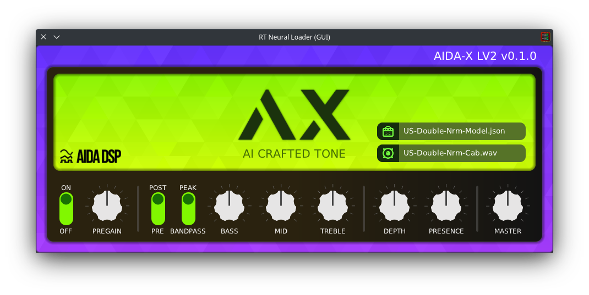

# AIDA-X

AIDA-X is an Amp Model Player, allowing it to load models of AI trained music gear, which you can then play through!

Its main intended use is to provide high fidelity simulations of amplifiers.  
However, it is also possible to run entire signal chains consisting of any combination of amp, cab, dist, drive, fuzz, boost and eq.

This repository contains the source code for the [DPF-based](https://github.com/DISTRHO/DPF) plugin variant, see [aidadsp-lv2](https://github.com/AidaDSP/aidadsp-lv2) for the LV2 embed version of the same engine.



### Installation ###

Builds are available through [GitHub actions](https://github.com/AidaDSP/aida-x/actions/workflows/build.yml).

Once the software is stable enough we will make proper releases with installers.

Alternatively an experimental online version is available at [aida.kx.studio](https://aida.kx.studio/).  
Audio input quality and latency in browsers is known to not be ideal, we will an integrated audio file player to it soon for easy testing.

### Building ###

Requires cmake and OpenGL related developer packages.  
For building just do the usual cmake steps, like:

```sh
git clone --recursive https://github.com/AidaDSP/aida-x.git && cd aida-x
mkdir build && cd build
cmake -DCMAKE_BUILD_TYPE=Release ..
cmake --build .
```

Binaries will be placed in `./build/bin`

### Technical Details ###

Behind the scenes AIDA-X uses [RTNeural](https://github.com/jatinchowdhury18/RTNeural), which does the heavy lifting for us.

#### Generate json models ####

This implies neural network training. Please follow __*Automated_GuitarAmpModelling.ipynb*__ script available on

- [Automated-GuitarAmpModelling](https://github.com/MaxPayne86/Automated-GuitarAmpModelling/tree/aidadsp_devel)

### License ###

AIDA-X is licensed under GPLv3+, see [LICENSE](LICENSE) for more details.
