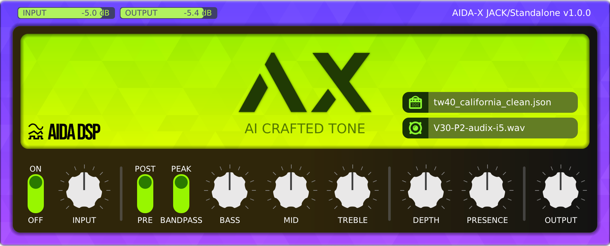

# AIDA-X

AIDA-X is an Amp Model Player, allowing it to load models of AI trained music gear, which you can then play through! 🎸

Its main intended use is to provide high fidelity simulations of amplifiers.  
However, it is also possible to run entire signal chains consisting of any combination of amp, cab, dist, drive, fuzz, boost and eq.

This repository contains the source code for the [DPF-based](https://github.com/DISTRHO/DPF) plugin variant, see [aidadsp-lv2](https://github.com/AidaDSP/aidadsp-lv2) for the LV2 headless version of the same engine optimized to run on embedded systems such as [MOD Dwarf](https://mod.audio/dwarf/), RPi, Portenta-X8, Aida DSP OS and so on.

For ease of use, this plugin also contains a cabinet simulator via impulse response files, which runs after the Amp Model.

CLAP, LV2, VST2 and VST3 plugin formats are supported, plus a standalone.



### Installation ###

[Click here to access the latest stable release](https://github.com/AidaDSP/AIDA-X/releases/latest).

Installers are provided for both macOS and Windows, plus regular binary tarballs for Linux.  
Do note these builds are not signed, so expect warnings saying they are from an "untrusted developer".

So-called "nightly builds" are available through [GitHub actions](https://github.com/AidaDSP/AIDA-X/actions/workflows/build.yml).

Alternatively an experimental online version is available at [mod.audio/neural-modelling](https://mod.audio/neural-modelling/).  
There is no audio input, instead a pre-selected list of guitar audio loops is used.  
This online version is otherwise fully functional and identical to the desktop version you can install and run on your machine.

### User Manual ###

#### Loading files ####

AIDA-X comes built-in with a single Amp Model and Cabinet IR.  
Click on the related filename to open a file browser and load a different file.  
The little icon on the left side allows to turn on/off the Amp Model and Cabinet IR.


A quick model pack can be downloaded from [our Google Drive folder](https://drive.google.com/drive/folders/18MwNhuo9fjK8hlne6SAdhpGtL4bWsVz-).

Check out the [MOD Forum's Neural Modelling section](https://forum.mod.audio/c/neural/62) for an online place for discussion, sharing and all things related to Amp Models.

#### Controls ####

From left to right:

1. **Bypass and Pre-Gain**


On/Off bypass switch, lets the audio pass-through when off.  
Integrates with the host provided bypass controls where possible.

Pre-Gain attenuates the input signal before sending it to the Amp Model.

2. **EQ tone controls (part 1)**


Pre/Post switch changes the position of the tone controls, either running before or after the Amp Model.

3. **EQ tone controls (part 2)**


Extra EQ related controls.  
Note: These will eventually be used for dynamic Amp Models, where the 2 parameters directly map into the operation of Model (the so-called "conditioned models").  

4. **Master Gain**


For a final gain compensation, does not apply to the bypassed signal.

### Technical Details ###

Behind the scenes AIDA-X uses [RTNeural](https://github.com/jatinchowdhury18/RTNeural), which does the heavy lifting for us.

The plugin format support together with the custom GUI is made with [DPF](https://github.com/DISTRHO/DPF), which allows a single codebase to export for many audio plugins at once (amongst other nice features).

Impulse Response handling is done with the help of a custom fork of [FFTConvolver](https://github.com/falkTX/FFTConvolver.git), together with [r8brain-free-src](https://github.com/avaneev/r8brain-free-src.git) for runtime audio file resampling.

#### Generate json models ####

This implies neural network training. Please follow __*Automated_GuitarAmpModelling.ipynb*__ script available on

- [Automated-GuitarAmpModelling](https://github.com/MaxPayne86/Automated-GuitarAmpModelling/tree/aidadsp_devel)

### Building ###

Requires cmake and OpenGL related developer packages.  
For building just do the usual cmake steps, like:

```sh
git clone --recursive https://github.com/AidaDSP/AIDA-X.git && cd AIDA-X
mkdir build && cd build
cmake -DCMAKE_BUILD_TYPE=Release ..
cmake --build .
```

Binaries will be placed in `./build/bin`

### License ###

AIDA-X is licensed under `GPL-3.0-or-later`, see [LICENSE](LICENSE) for more details.
